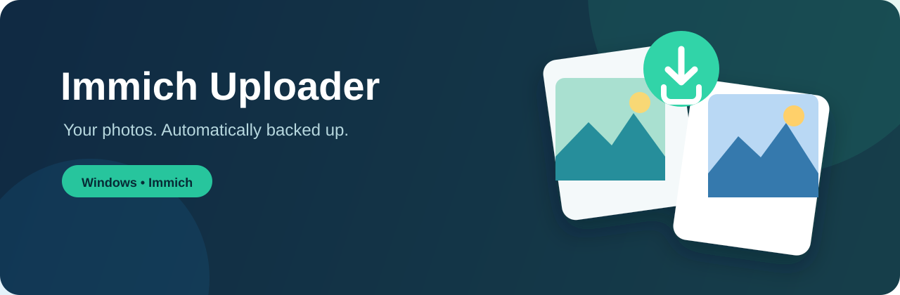

  

  
  
  

<strong>🇫🇮 <a href="#suomi">Suomi</a> · 🇬🇧 <a href="#english">English</a></strong>

---

## Suomi

**Immich Uploader** on kevyt Windowsin ilmoitusalueella toimiva taustalataaja. Se tarkkailee valitsemiasi kansioita ja varmuuskopioi kuvat ja videot automaattisesti omaan Immich-palvelimeesi.

### Lataa ja aloita

1. [Lataa uusin julkaisu](https://github.com/lafkato/immich-uploader/releases/latest) ja käynnistä `ImmichUploader.exe`.
2. Anna asetuksissa Immich-palvelimen API-osoite ja API-avain.
3. Valitse tarkkailtavat kansiot. Sovellus jatkaa toimintaansa huomaamattomasti ilmoitusalueella.

> [!TIP]
> Sovellus on self-contained: erillistä .NET-asennusta ei tarvita.

### Ominaisuudet

- Automaattinen kuvien ja videoiden lataus valituista kansioista
- Albumin valinta, kansioiden poissulku sekä Windowsin käynnistyksen yhteydessä avautuminen
- Päällekkäisten latausten esto, tiedoston valmiustarkistus ja automaattiset uudelleenyritykset
- Suomen, englannin, ruotsin ja saksan kielet sekä vaalea/tumma ulkoasu
- API-avain suojataan Windowsin DPAPI-salauksella

### Tue kehitystä ☕

Sovellus on maksuton henkilökohtaiseen käyttöön. Jos siitä on sinulle iloa, voit halutessasi auttaa uusia päivityksiä ja ylläpitoa pienellä kahvirahalla. Lahjoitus on aina täysin vapaaehtoinen.

  

### Yksityisyys ja lisenssi

Sovellus tallentaa asetukset ja lataushistorian Windows-käyttäjäprofiiliisi. API-avain salataan käyttäjäkohtaisesti. Lähdekoodi on näkyvissä läpinäkyvyyttä varten, mutta projekti ei ole avoimen lähdekoodin ohjelmisto: käyttö on sallittu henkilökohtaiseen, ei-kaupalliseen tarkoitukseen. Katso tarkat ehdot [lisenssistä](LICENSE).

---

## English

**Immich Uploader** is a lightweight Windows tray app that watches the folders you choose and automatically backs up photos and videos to your own Immich server.

### Download and get started

1. [Download the latest release](https://github.com/lafkato/immich-uploader/releases/latest) and run `ImmichUploader.exe`.
2. Enter your Immich API URL and API key in Settings.
3. Choose the folders to watch. The app then runs quietly in the system tray.

> [!TIP]
> The app is self-contained — no separate .NET installation is required.

### Highlights

- Automatic photo and video uploads from selected folders
- Album selection, folder exclusions, and optional start with Windows
- Duplicate prevention, file-stability checks, and automatic retries
- Finnish, English, Swedish, and German interfaces with light and dark themes
- Your API key is protected with Windows DPAPI encryption

### Support development ☕

Immich Uploader is free for personal use. If it makes your photo backup easier, you can optionally support future updates and maintenance with a small coffee. Donations are always voluntary.

  

### Privacy and license

The app stores its settings and upload history in your Windows user profile. API keys are encrypted for that Windows user. The source is available for transparency, but this is not open-source software: use is permitted for personal, non-commercial purposes. Read the full [license](LICENSE).
